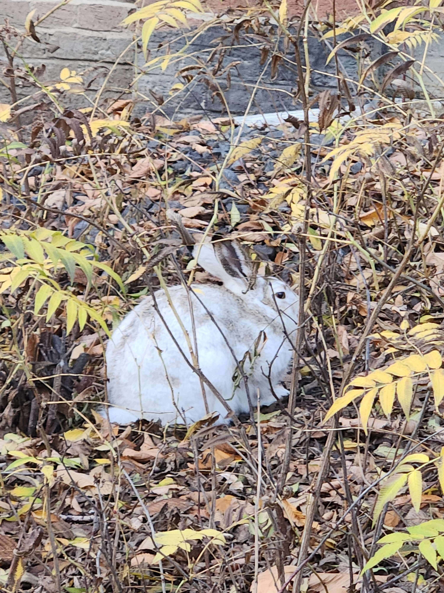
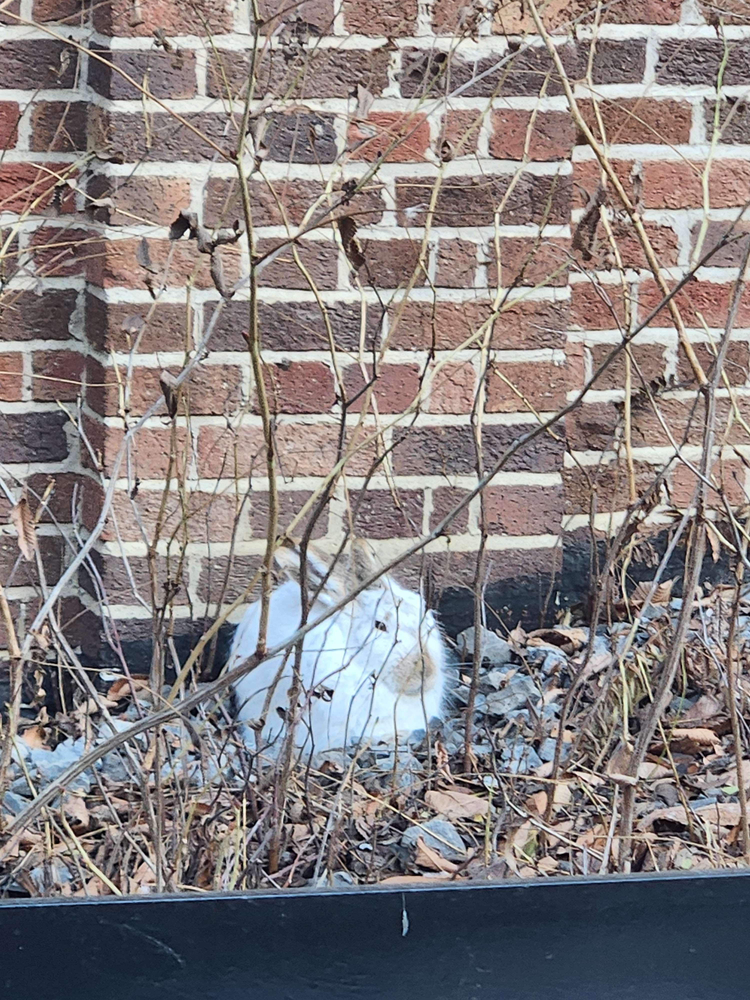

#### Hi I'm Nikola

---
* I am a Undergraduate student at The University of Alberta with an interest in backend
  development, Homelabbing and Cybersecurity.
* I am an executive at Cybersecurity, Hacking And Digital Security 
  [(CHADS, UAlberta)](https://linktr.ee/chadsualberta)

* I over the summer I worked at [CodeNinjas](https://www.codeninjas.com/), teaching C# 
  with a focus on game develolpment.

* My page is emptier than it should be since I have a good portion of my projects privated.
---


##### Look at this basketball sized rabbit
<p align="center">
    
    
</p>

--- 
##### A calculator program which I am very proud of:
```python
from openai import OpenAI

print("Welcome to my calc (calculator)")
usr_in = input("Please enter your equation: ")

client = OpenAI()
prompt = client.chat.completions.create(
    model="gpt-4o-mini",
    messages=[{"role": "user", "content": "Compute the following expression " + usr_in}],
)

print("Result: " + resp.choices[0].message.content)

```
---

* Please see my LinkedIn for my experience.
